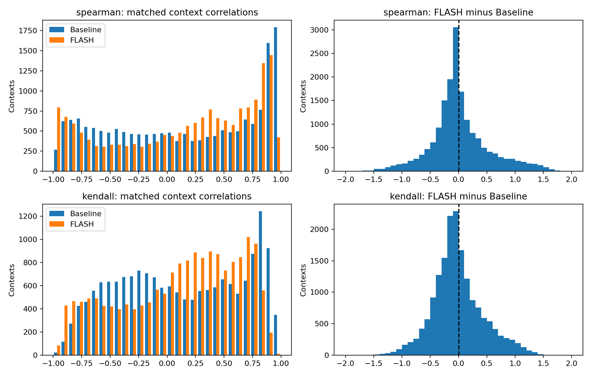

# Frostbite 가치 함수 비교

평가 프레임 17,424개, 에피소드 21개, 블록 322개.
Bootstrap: episode 단위 paired 재표집 10,000회, percentile 95% CI, seed=2027.

| 상관계수 | Baseline 평균 [95% CI] | FLASH 평균 [95% CI] | 차이 [95% CI] |
|---|---:|---:|---:|
| spearman | 0.1348 [0.1046, 0.1651] | 0.1537 [0.1264, 0.1821] | 0.0189 [-0.0230, 0.0586] |
| kendall | 0.1201 [0.0941, 0.1459] | 0.1057 [0.0835, 0.1290] | -0.0143 [-0.0495, 0.0189] |

평균 차이가 절대 효과 크기입니다. 차이의 CI가 0을 포함하는지로 통계적 불확실성을 확인합니다.
이 구간은 두 고정 체크포인트의 평가 문맥에 대한 불확실성입니다. 학습 시드 간 변동을 포함하지 않습니다.
에피소드 수도 작다면 신뢰구간을 탐색적으로 해석하세요. 유효 재표집 단위가 1개뿐이면 CI를 계산하지 않습니다.
block을 선택하면 블록 사이의 의존성은 반영하지 못합니다. 기본값 episode를 권장합니다.

| 지표 | Baseline 중앙값 [Q1, Q3] | FLASH 중앙값 [Q1, Q3] | 차이 중앙값 [Q1, Q3] | FLASH 개선 비율 | 제외 쌍 |
|---|---:|---:|---:|---:|---:|
| spearman | 0.1729 [-0.4541, 0.7779] | 0.2994 [-0.3707, 0.7119] | -0.0441 [-0.2415, 0.2337] | 42.6% | 0 |
| kendall | 0.1072 [-0.3397, 0.6264] | 0.1933 [-0.2888, 0.5387] | -0.0631 [-0.2755, 0.2134] | 42.0% | 0 |

한 평가 문맥은 동일한 관측·행동 이력에 이글루 17단계 변형을 적용한 한 평가 시점입니다.
예측이 상수인 경우 상관계수는 정의되지 않습니다. 해당 비교 쌍을 제외하며 0으로 대체하지 않습니다.
개별 값과 정의 불가 개수는 per_context_correlations.csv 및 statistics.json에 저장합니다.
평균 개선이 관찰되더라도 절대 상관계수의 크기를 함께 해석해야 하며, 이 결과만으로 공간적 얽힘의 원인이나 해소를 입증하지 않습니다.

